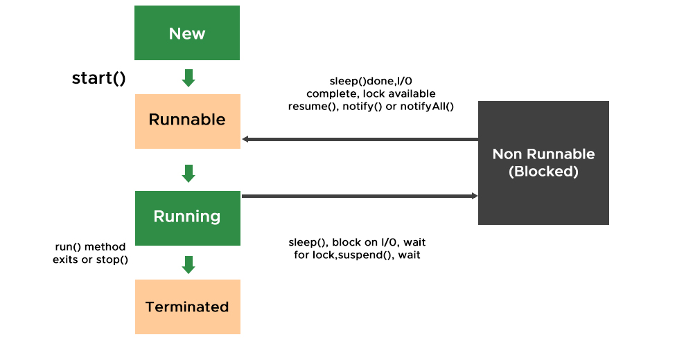

# Java Threads

    1. Process: An independent instance of an executing program.
    2. Thread: A subset of a process that shares resources to perform concurrent work.
    3. Task: A general term for a unit of work that can be implemented by Process or Thread.

## Phase 1: The Raw Thread Era (Java 1.0 - 1.4)
This is the foundational layer. Every thread maps 1:1 to an OS thread (platform thread). 
Creating them is expensive, and managing their lifecycles manually is error-prone.

The Approach:

1. Implementing Runnable or extending Thread.
2. Using intrinsic locks: synchronized, wait(), notify(), notifyAll().

Code Sample:
 
// The classic producer/consumer manual loc

    public class LegacyProcessor {
        private final Object monitor = new Object();
         public void process() throws InterruptedException {
            synchronized(monitor) {
                while (!conditionMet()) {
                    monitor.wait(); // Releases lock, waits for notify()
                }
                // Execute business logic
                monitor.notifyAll(); 
            }
        }
    }

### Questions:

1. What is the "Happens-Before" relationship in the Java Memory Model? * 
Focus: Volatile keyword, instruction reordering, memory visibility across CPU caches.

2. Explain the exact cost of a context switch. * Focus: OS kernel involvement, saving registers, flushing the TLB (Translation Lookaside Buffer), and cache invalidation.

3. Why is notifyAll() generally preferred over notify()?
Focus: Preventing lost wake-ups when multiple threads are waiting on the same monitor for different conditions.

## Phase 2: The Executor & Concurrent Utilities Era (Java 5+)
Java 5 introduced java.util.concurrent (JUC), shifting the paradigm from managing threads to managing tasks.

The Approach:

1. Thread Pools (ExecutorService), Callable, and Future.

2. Explicit locking (ReentrantLock, ReadWriteLock).

Concurrent collections (ConcurrentHashMap) and synchronizers (CountDownLatch, CyclicBarrier, Semaphore).

Hardware-level atomic operations via CAS (Compare-And-Swap) using AtomicInteger, etc.

Code Sample:

Java
// Bounded thread pool for handling I/O heavy tasks

    ExecutorService executor = Executors.newFixedThreadPool(Runtime.getRuntime().availableProcessors() * 2);
    
    Callable<String> task = () -> {
    // Perform database or network call
    return "Result";
    };

    Future<String> future = executor.submit(task);
    // Do other work...
    String result = future.get(); // Blocks until the result is available
    executor.shutdown();

### Questions:

How do you size a thread pool for CPU-bound vs. I/O-bound workloads?

Focus: Little's Law. CPU-bound = N_cores + 1. I/O bound = N_cores * (1 + WaitTime/ComputeTime).

How does ConcurrentHashMap achieve high throughput compared to Collections.synchronizedMap()?

Focus: Lock striping (in Java 7) vs. CAS operations and synchronized nodes (Java 8+).

What happens when a ThreadPoolExecutor queue fills up?

Focus: Rejection policies (AbortPolicy, CallerRunsPolicy, etc.) and backpressure strategies in high-throughput systems.

## Phase 3: The Asynchronous Era (Java 8+)
As microservices and event-driven architectures became standard, blocking on a Future.get() became a bottleneck. 
CompletableFuture allowed for non-blocking, functional-style asynchronous pipelines.

The Approach:

Chaining dependent tasks asynchronously without holding up platform threads.

Combining multiple asynchronous operations (allOf, anyOf).

Handling exceptions functionally within the pipeline.

Code Sample:

Java
// Asynchronous pipeline fetching user data and enriching it

    CompletableFuture.supplyAsync(() -> fetchUserData(userId))
    .thenApplyAsync(user -> enrichWithPermissions(user))
    .thenAccept(enrichedUser -> saveToDatabase(enrichedUser))
    .exceptionally(ex -> {
        log.error("Pipeline failed", ex);
        return null;
    });
Principal-Level Interview Questions:

What thread pool does CompletableFuture use by default, and why is that dangerous in a production web application?

Focus: It uses the common ForkJoinPool. If one I/O-heavy task blocks the common pool, it starves all other CompletableFutures in the JVM. Always pass a custom Executor for I/O tasks.

Compare CompletableFuture to Reactive frameworks (like Project Reactor/WebFlux).

Focus: Push vs. Pull models, handling streams of data vs. single values, and built-in backpressure handling.

## Phase 4: The Virtual Thread Era (Java 21+)
Project Loom fundamentally changed the JVM by decoupling the Java thread from the OS thread. Virtual threads are cheap, lightweight, and managed by the JVM. When a virtual thread makes a blocking I/O call, the JVM unmounts it from the underlying "carrier" OS thread, allowing the OS thread to execute another virtual thread.

The Approach:

Thread-per-request model is viable again, even for millions of concurrent connections.

No need for complex reactive programming just to save threads.

Structured Concurrency (currently in preview) to manage lifetimes of concurrent tasks cleanly.

Code Sample:

Java
// Launching 10,000 virtual threads is now trivial and cheap
    
    try (var executor = Executors.newVirtualThreadPerTaskExecutor()) {
        IntStream.range(0, 10_000).forEach(i -> {
            executor.submit(() -> {
            // A blocking I/O call here does NOT block an OS thread
            fetchDataFromExternalService(i);
            });
        });
    } // Executor automatically waits for all tasks to finish here

### Interview Questions:

In what scenarios do Virtual Threads perform poorly?

Focus: CPU-bound tasks. Virtual threads solve the blocking I/O problem (waiting for databases, REST calls, Kafka brokers). 
They do not magically give you more CPU cycles for heavy computations.

What is "Thread Pinning" in the context of Virtual Threads?

Focus: When a virtual thread executes inside a synchronized block or calls a native method, it gets "pinned" to its carrier OS thread. If it blocks while pinned, the carrier thread is also blocked. (Using ReentrantLock avoids this).

How do Virtual Threads impact ThreadLocal usage?

Focus: If you have 1 million virtual threads, having heavy objects in ThreadLocal variables will cause massive 
heap bloat and garbage collection pressure. Scoped Values are being introduced as a modern replacement.